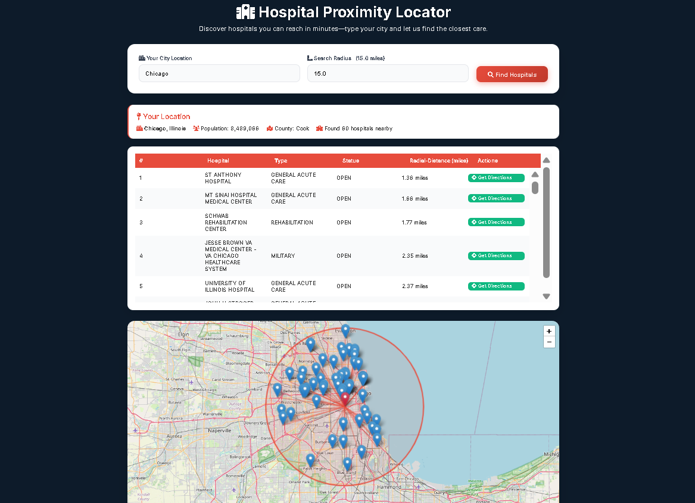

🩺 Hospital Proximity Locator
=============================

A web application that allows users to find hospitals within a specified radius of any U.S. city. The application displays the results in an interactive map and a sortable table, providing quick access to hospital details and driving directions.



✨ Features
----------
-   **City-Based Search**: Enter any U.S. city to find nearby medical facilities.

-   **Customizable Radius**: Define a search radius in miles to narrow or broaden the search area.

-   **Interactive Map**: Visualizes the searched city, the search radius, and all nearby hospitals using Leaflet.js.

    -   Custom markers for the user's location (red) and hospitals (blue).

    -   Lines connecting the city center to each hospital for easy visualization.

    -   Informative popups on hover with hospital details and action buttons.

-   **Detailed Results Table**: Lists all found hospitals with information like name, type, status, and distance. The table is scrollable and sortable by distance.

-   **One-Click Directions**: Provides direct links to Google Maps for both driving directions from the searched city and the hospital's location.

-   **Responsive Design**: A clean, modern UI that works seamlessly on both desktop and mobile devices.

-   **Efficient Backend**: Uses Scikit-learn's `BallTree` with the Haversine metric for highly efficient and accurate geospatial queries, even with large datasets.

* * * * *

⚙️ How It Works
---------------

The application's logic is straightforward yet powerful:

1.  **User Input**: The user enters a city name and an optional search radius on the frontend.

2.  **Data Processing**: The Flask backend receives the request and loads U.S. city and hospital data from local CSV files into Pandas DataFrames.

3.  **Location Lookup**: It finds the latitude and longitude of the specified city.

4.  **Geospatial Query**: A `BallTree` is constructed from the coordinates of all hospitals. This data structure is optimized for spatial queries. The tree is queried to find all hospitals within the user-defined radius from the city's coordinates.

5.  **Data Enrichment**: The application calculates the precise distance in miles for each nearby hospital and generates unique Google Maps URLs for directions and location viewing.

6.  **Rendering**: The results are sent back to the `index.html` template. Jinja2 renders the information dynamically, and client-side JavaScript uses Leaflet.js to populate the interactive map with markers, popups, and the search radius circle.

* * * * *

🛠️ Tech Stack
--------------

### Backend

-   **Python**: Core programming language.

-   **Flask**: A lightweight WSGI web application framework for handling routing and backend logic.

-   **Pandas**: Used for loading, cleaning, and managing the city and hospital datasets from CSV files.

-   **NumPy**: Provides support for efficient numerical operations, especially on coordinate arrays.

-   **Scikit-learn**: Specifically, the `BallTree` class is used for efficient nearest-neighbor searches based on the Haversine distance metric.

### Frontend

-   **HTML5**: The standard markup language for creating the web page structure.

-   **CSS3**: Used for styling the application, with a focus on a modern and responsive layout.

-   **JavaScript**: Powers the client-side interactivity, particularly for the map.

-   **Leaflet.js**: An open-source JavaScript library for creating interactive maps.

-   **Jinja2**: The templating engine for Flask, used to dynamically generate HTML with backend data.

-   **Font Awesome**: Provides a rich library of icons used throughout the UI.

* * * * *

🚀 Setup and Installation
-------------------------

Follow these steps to get the project running on your local machine.

### Prerequisites

-   Python 3.12.10

-   pip (Python package installer)

### 1\. Clone the Repository

Bash

```
git clone https://github.com/your-username/hospital-proximity-locator.git
cd hospital-proximity-locator

```

### 2\. Create and Activate a Virtual Environment

It's recommended to use a virtual environment to manage project dependencies.

-   **On macOS/Linux:**

    Bash

    ```
    python3 -m venv venv
    source venv/bin/activate

    ```

-   **On Windows:**

    Bash

    ```
    python -m venv venv
    .\venv\Scripts\activate

    ```

### 3\. Install Dependencies

Install all the required Python packages from the `requirements.txt` file.

Bash

```
pip install Flask pandas numpy scikit-learn

```

### 4\. Ensure Data Files Are Present

Make sure the following data files are in the root directory of the project:

-   `uscities.csv`

-   `us_hospital_locations.csv`

### 5\. Run the Application

Start the Flask development server.

Bash

```
python app.py

```

The application will automatically open in your default web browser at `http://127.0.0.1:5000`.

* * * * *

📂 Project Structure
--------------------

```
.
├── app.py                      # Main Flask application logic
├── templates/
│   └── index.html              # Frontend HTML, CSS, and JS
├── uscities.csv                # Dataset of US cities and coordinates
├── us_hospital_locations.csv   # Dataset of US hospital locations and details
└── README.md                   # You are here!
```